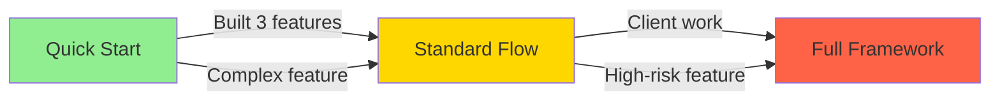

# AI-Dev-Orchestrator
This repo has been assembled by a non-coder who's trying to get more out of ai coding. I'm probably pushing the boundaries a little far in terms of what I can achieve without a developer but this is where I've got to so far. Would love to collaborate with anyone interested in this space.

My journey:
Replit: ask it to build a basic thing, end up pushing bugs all around the place (but it does the hosting well)
Claude code: fix the replit apps, still pushing bugs but a little more effective.
Discover AI Dev Tasks by Snarktank which opens my brain to the potential of a few documents to make a HUGE difference to the process but...
I'm still not sure about the prompts I should use and the roles I need and what's the document that ties all of this together...?
Enter a Gemini (2.5 pro) deep research article which finds a whole lot more insight which I've assembled here via a few prompts with Claude Opus 4.1 to make sure it's actually useful.
Now comes the testing... I've started applying this to a couple of projects and will update this as I learn.
The rest of this doc was assembled with AI

**A structured framework for AI-driven software development.**

Transform from "vibe coding" to orchestrating a specialized AI development team with prompts, personas, and workflows.

---

## What is AI Dev Flow?

AI Dev Flow is a complete, research-backed framework for building software with AI assistance. Instead of asking a single AI to "write my app," you orchestrate a **team of specialized AI personas** through a proven **four-phase workflow**, using **copy-paste ready prompts** and **quality guardrails**.

**The result:** Professional, consistent, maintainable code without over-engineering.

---

## The Problem This Solves

Common AI coding approach (❌ naive):
```
Prompt: "You are a senior developer. Build me a password reset feature."
Result: Inconsistent, over-engineered, or incomplete code
```

AI Dev Flow approach (✅ structured):
```
Phase 1: Product Owner    → Create PRD (requirements)
Phase 1: Architect        → Create Tech Spec (design)
Phase 2: Developer        → Implement task-by-task
Phase 3: QA Engineer      → Review for quality & security
Phase 4: Technical Writer → Document the solution
```

**Result:** Well-planned, properly implemented, thoroughly reviewed code.

---

## Quick Start

### 1. Copy This Template to Your Project

```bash
# Create your new project
mkdir my-new-project
cd my-new-project

# Copy the CONSTITUTION template
cp /path/to/ai-dev-flow/CONSTITUTION-TEMPLATE.md ./CONSTITUTION.md

# Customize CONSTITUTION.md for your project
# (Edit tech stack, coding standards, etc.)
```

### 2. Start Your First Feature

```bash
# Use the Product Owner to create a PRD
# Copy prompt from: prompts/phase-1-planning/1.1-product-owner-prd.md
# Paste into Claude/ChatGPT with your feature idea
```

### 3. Follow the Workflow

```
Phase 1 → Phase 2 → Phase 3 → Phase 4
(Plan)   (Implement) (Review)  (Document)
```

See [SETUP-GUIDE.md](./SETUP-GUIDE.md) for detailed instructions.

---

## 🎯 Choose Your Path

**New to AI-driven development?** Start simple. **Building production systems?** Use the full framework.

### 🚀 Quick Start (New to AI Coding)
**Time:** 2-3 hours per feature | **Files:** 3 essential prompts | **Perfect for:** Learning, prototypes, internal tools

**What you'll use:**
- Simple workflow combining PRD + task generation
- Interactive task management
- Basic testing (manual)

**Start here:** [`/quick-start/README.md`](./quick-start/README.md)

**Example projects:**
- Team task tracker
- Expense reporting tool
- Internal admin dashboard

---

### 🏗️ Standard Flow (Building for Others)
**Time:** 1-3 days per feature | **Files:** 8 core prompts + personas | **Perfect for:** Client work, team projects, SaaS apps

**What you'll use:**
- Full PRD and Tech Spec
- Task-by-task implementation
- QA reviews before shipping
- Basic documentation

**Start here:** [`/workflow/workflow-overview.md`](./workflow/workflow-overview.md)

**Example projects:**
- Client-facing applications
- SaaS products
- Professional web apps

---

### 🏭 Full Framework (Production Systems)
**Time:** 3-5 days per feature | **Files:** 15+ specialized prompts | **Perfect for:** Complex systems, regulated industries, high-risk features

**What you'll use:**
- All 5 specialized personas
- Database and API design workflows
- Comprehensive reviews (QA + Security + Performance)
- Complete documentation suite

**Start here:** Read this complete README, then [`/workflow/prompt-selection-guide.md`](./workflow/prompt-selection-guide.md)

**Example projects:**
- Payment integrations
- Healthcare applications
- Enterprise systems
- Features handling sensitive data (PII, payments)

---

### 🧭 Not Sure Which Path?

Use the **Complexity Estimator**:

```
I want to build [describe your feature].

Follow /prompts/phase-0-setup/complexity-estimator.md to analyze
this feature and recommend Quick Start, Standard, or Full Framework.
```

The AI will analyze your feature and recommend the best workflow based on:
- Technical complexity
- Risk level
- User count
- Your experience

**[Read the Complexity Estimator →](./prompts/phase-0-setup/complexity-estimator.md)**

---

### 📈 Your Growth Path



**Progression:**
1. **Week 1:** Quick Start - Build 2-3 simple features, learn the core workflow
2. **Month 1:** Standard Flow - Add quality controls, build for others
3. **Month 2+:** Full Framework - Master all personas, build production systems

**You can always upgrade:** Start with Quick Start, graduate to Standard or Full as your needs grow.

---

### 🛠️ Tool-Specific Setup Guides

Choose your AI coding tool and follow the setup guide:

- **[Cursor IDE](./guides/cursor-setup.md)** - Recommended for beginners (visual, intuitive)
- **[Claude Code](./guides/claude-code-setup.md)** - For CLI enthusiasts (powerful, terminal-based)
- **[Replit AI](./guides/replit-setup.md)** - For instant deployment (browser-based, zero setup)

Each guide includes:
- Installation and setup
- Project integration
- Workflow examples
- Best practices
- Troubleshooting

---

### 📚 Constitution Templates

Not sure how to configure your project? Start with a template:

- **[Internal Tool](./templates/internal-tool-constitution.md)** - For team tools (5-50 users, fast iteration)
- **[Client Application](./templates/client-app-constitution.md)** - For customer-facing apps (security, polish)
- **[AI Agent/Bot](./templates/ai-agent-constitution.md)** - For bots and API services (reliability, integrations)

**[See all templates →](./templates/README.md)**

---

## What's Included

### 📋 Templates & Documents

- **CONSTITUTION-TEMPLATE.md** - Project standards and guardrails
- **RESEARCH-ORIGIN.md** - The Gemini Deep Research that informed this framework

### 👥 5 AI Personas

Each persona is a specialist with specific prompts:

1. **Product Owner** - Defines what and why (creates PRDs)
2. **Solutions Architect** - Defines how (creates tech specs, schemas, APIs)
3. **Specialist Developer** - Implements code task-by-task
4. **QA Engineer** - Reviews for quality, security, bugs
5. **Technical Writer** - Creates documentation

See [personas/](./personas/README.md)

### 📝 15 Production-Ready Prompts

Copy-paste prompts organized by phase:

**Phase 1 - Planning (4 prompts):**
- 1.1 Product Owner - PRD Generation
- 1.2 Solutions Architect - Tech Spec
- 1.3 Database Schema Design
- 1.4 API Endpoint Design

**Phase 2 - Implementation (3 prompts):**
- 2.1 Generate Task List
- 2.2 Iterative Implementation (one task at a time)
- 2.3 Code Commenter

**Phase 3 - Review (6 prompts):**
- 3.1 Comprehensive Code Review
- 3.2 Bugs & Edge Cases (specialized)
- 3.3 Security Audit (specialized)
- 3.4 Style & Standards Check (specialized)
- 3.5 Testability Assessment (specialized)
- 3.6 Refactoring Consultation (trade-off analysis)

**Phase 4 - Documentation (2 prompts):**
- 4.1 README.md Generator
- 4.2 User Guide Generator (for non-technical users)

See [prompts/](./prompts/)

### 🔄 Workflow Documentation

- [Workflow Overview](./workflow/workflow-overview.md) - Visual workflow diagram
- [Prompt Selection Guide](./workflow/prompt-selection-guide.md) - Which prompt to use when
- [Phase Checklist](./workflow/phase-checklist.md) - Ensure you complete each phase

---

## The Four-Phase Workflow

```
┌─────────────────────────────────────────────────────────────┐
│                     Phase 1: PLANNING                        │
│  Product Owner → PRD → Architect → Tech Spec → DB/API       │
└─────────────────────────────────────────────────────────────┘
                              ↓
┌─────────────────────────────────────────────────────────────┐
│                  Phase 2: IMPLEMENTATION                     │
│   Generate Task List → Implement Task #1 → Task #2 → ...    │
└─────────────────────────────────────────────────────────────┘
                              ↓
┌─────────────────────────────────────────────────────────────┐
│               Phase 3: REVIEW & REFACTORING                  │
│   QA Review → Fix Issues → (Optional) Refactor Consult      │
└─────────────────────────────────────────────────────────────┘
                              ↓
┌─────────────────────────────────────────────────────────────┐
│                  Phase 4: DOCUMENTATION                      │
│              README → User Guides → SHIP IT 🚀               │
└─────────────────────────────────────────────────────────────┘
```

---

## Core Principles

### 1. Plan. Prompt. Validate. Refactor.

- **Plan** manually (PRD + Tech Spec) before writing code
- **Prompt** intentionally (one task, one persona at a time)
- **Validate** critically (always review AI output)
- **Refactor** with context (understand trade-offs)

### 2. Constitution as Law

Every AI persona must follow `CONSTITUTION.md`:
- Technical stack (mandated & prohibited technologies)
- Coding standards (naming, formatting, comments)
- Security requirements
- Non-negotiable principles (simplicity, user-centricity, etc.)

This prevents drift and ensures consistency.

### 3. One Task at a Time

Don't ask AI to "build the whole feature."

✅ Do: Implement task #3: "Create POST /api/auth/password-reset endpoint"
❌ Don't: "Build the entire password reset system"

### 4. Human as Orchestrator

You are not a passive user. You are the conductor:
- You assign tasks to personas
- You review each output
- You make the final decisions
- AI provides expertise, you provide judgment

---

## Why This Works

### Based on Research

This framework synthesizes:
- **AI Dev Tasks** methodology (task-based prompting)
- **Persona-based AI programming** (specialized roles)
- **Government Digital Service (GDS)** compliance patterns
- **OWASP** security best practices
- **Constitutional AI** principles

See [RESEARCH-ORIGIN.md](./RESEARCH-ORIGIN.md)

### Battle-Tested Patterns

- ✅ Avoids "over-engineering" by enforcing simplicity (CONSTITUTION.md)
- ✅ Prevents scope creep with explicit acceptance criteria
- ✅ Catches bugs early with specialized QA reviews
- ✅ Maintains consistency with project-wide standards
- ✅ Enables informed decisions with trade-off analysis

---

## Example: Building a Password Reset Feature

### Phase 1: Planning (15 min)

```markdown
1. Product Owner → Generates PRD with user stories
2. Solutions Architect → Generates tech spec
3. Review & approve both documents
```

**Output:** `docs/password-reset-prd.md`, `docs/password-reset-tech-spec.md`

### Phase 2: Implementation (2-3 hours)

```markdown
1. Generate task list (17 tasks)
2. For each task:
   - Use "Iterative Implementation" prompt
   - Review code
   - Test
   - Commit
```

**Output:** Working code

### Phase 3: Review (30 min)

```markdown
1. QA Comprehensive Review → Finds 3 CRITICAL, 2 HIGH, 5 MEDIUM issues
2. Fix all CRITICAL & HIGH issues
3. (Optional) Security Audit → Verify fixes
```

**Output:** Production-ready code

### Phase 4: Documentation (20 min)

```markdown
1. README Generator → Creates README.md
2. (Optional) User Guide → For internal users
```

**Output:** Documented feature

**Total time:** ~3-4 hours for a complete, professional feature

---

## Project Structure

```
ai-dev-flow/
├── README.md                          # This file
├── SETUP-GUIDE.md                     # Detailed setup instructions
├── CONSTITUTION-TEMPLATE.md           # Copy this to your projects
├── RESEARCH-ORIGIN.md                 # The research behind this
│
├── personas/                          # AI persona definitions
│   ├── README.md                      # Persona overview
│   ├── 01-product-owner.md
│   ├── 02-solutions-architect.md
│   ├── 03-specialist-developer.md
│   ├── 04-qa-engineer.md
│   └── 05-technical-writer.md
│
├── prompts/                           # Copy-paste ready prompts
│   ├── phase-1-planning/
│   │   ├── 1.1-product-owner-prd.md
│   │   ├── 1.2-architect-tech-spec.md
│   │   ├── 1.3-architect-database-schema.md
│   │   └── 1.4-architect-api-design.md
│   ├── phase-2-implementation/
│   │   ├── 2.1-generate-task-list.md
│   │   ├── 2.2-iterative-implementation.md
│   │   └── 2.3-code-commenter.md
│   ├── phase-3-review/
│   │   ├── 3.1-qa-comprehensive-review.md
│   │   ├── 3.2-qa-bugs-edge-cases.md
│   │   ├── 3.3-qa-security-audit.md
│   │   ├── 3.4-qa-style-standards.md
│   │   ├── 3.5-qa-testability.md
│   │   └── 3.6-architect-refactor-consultation.md
│   └── phase-4-documentation/
│       ├── 4.1-readme-generator.md
│       └── 4.2-user-guide-generator.md
│
├── workflow/                          # Process documentation
│   ├── workflow-overview.md
│   ├── prompt-selection-guide.md
│   └── phase-checklist.md
│
└── examples/
    └── sample-internal-tool/          # (Future: working example)
```

---

## Integration with AI Dev Tasks

This framework is compatible with and enhances [AI Dev Tasks](https://github.com/snarktank/ai-dev-tasks):

- **AI Dev Tasks:** Provides task management and workflow structure
- **AI Dev Flow:** Provides the personas, prompts, and quality guardrails

Use them together for maximum effectiveness.

---

## Frequently Asked Questions

### Do I need to use all 15 prompts?

No. Use what you need. Common minimal flow:
- 1.1 Product Owner (PRD)
- 2.2 Iterative Implementation (code)
- 3.1 QA Review
- 4.1 README

### Which AI should I use?

This works with any AI:
- Claude (Sonnet/Opus) - Excellent for all prompts
- ChatGPT (GPT-4) - Great for implementation and review
- Gemini - Good for research and planning

### Can I modify the prompts?

Yes! These are templates. Customize for your needs.

### What if I'm a solo developer?

This framework is IDEAL for solo developers. You get the benefit of a full team's expertise (PM, Architect, QA, etc.) without hiring anyone.

### Isn't this overkill for small projects?

For trivial changes (e.g., "change button text"), yes.

For any feature that requires planning, this saves time by catching issues early.

---

## Get Started

1. **Read:** [SETUP-GUIDE.md](./SETUP-GUIDE.md)
2. **Copy:** `CONSTITUTION-TEMPLATE.md` to your project
3. **Use:** Your first prompt (`1.1-product-owner-prd.md`)

---

## Contributing

This framework is open for improvement:

- Found a better prompt? Share it
- Built an example project? Contribute it
- Have workflow improvements? Open an issue

---

## Credits

**Created by:** Malcolm (with Gemini Deep Research 2.5 Pro + Claude Sonnet 4.5)

**Research Sources:**
- AI Dev Tasks (snarktank)
- Persona-Based AI Programming (humanwhocodes.com)
- GDS Design Principles
- OWASP Security Standards
- Constitutional AI (Anthropic)

See [RESEARCH-ORIGIN.md](./RESEARCH-ORIGIN.md) for full citations

---

## License

MIT License - Use freely, attribution appreciated

---

**Ready to build better software with AI?**

Start here: [SETUP-GUIDE.md](./SETUP-GUIDE.md)
